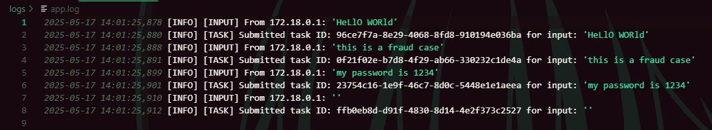

# 🛠 Text Processing API with Alerts

This project provides a simple FastAPI-based web service that accepts text input, processes it asynchronously via Celery, tuning into lowercase (it can be any API and ML operation), and generates alerts for suspicious or sensitive content. All operations are logged, and alerts are saved as timestamped reports.

---

## 📦 Architecture Overview

### 🧩 Components

| Component        | Description                                                                 |
|------------------|-----------------------------------------------------------------------------|
| **FastAPI App**  | HTTP interface that receives text input and dispatches background jobs.     |
| **Celery Worker**| Asynchronous task runner for processing input and generating alerts.        |
| **Redis**        | Broker and backend for Celery task queuing and result storage.              |
| **Logger**       | Logs all API inputs, task submissions, and results to file and console.     |
| **Alert Engine** | Saves alerts to disk as timestamped `.txt` files in `error_reports/`.       |

---

## 📂 Project Structure

```text
app/
├── main.py         # FastAPI app
├── tasks.py        # Celery task logic
├── logger.py       # Logger setup
├── alert_engine.py # Alert file writer
logs/
└── app.log         # Combined console + file logging
error_reports/
└── *.txt           # Generated alert reports
test.py             # Automated test runner with test cases
```

---


## 🔄 Execution Flow

1. **Synchronous Operation**
   - FastAPI receives a plain-text `POST /process` request.
   - The text is logged and passed to a background task (non-blocking).
   - API responds **immediately** with `200 OK` and the Celery task ID.

2. **Asynchronous Operation**
   - Celery worker receives the task and processes it:
     - Converts input to lowercase.
     - Detects keywords (`fraud`, `password`, `ssn`, or empty input).
     - If found, triggers `generate_alert()` which saves an alert file.
   - Logs input and final processed result.

---

## ⚙️ System Diagram

```text
                +-------------+
Client -------> |  FastAPI    | ----(via Redis)--+
                |  /process   |                  |
                +-------------+                  v
                                               Celery
                                                Task
                                                 |
                          +----------------------+-----------------+
                          |                                        |
                process input                         generate alerts if needed
                          |                                        |
                logs + response                        writes .txt file to /error_reports
```

---

## 📈 Scaling Strategy

| Simultaneous Users | Scaling Approach                                                                 |
|--------------------|-----------------------------------------------------------------------------------|
| **10 Users**       | Single FastAPI instance + 1 Celery worker + 1 Redis instance is sufficient.       |
| **50 Users**       | Increase Celery workers to 3–5. Use `gunicorn -w 4` to serve FastAPI concurrently.|
| **100+ Users**     | Run FastAPI with `gunicorn -w 8`, scale Redis (hosted/cloud), and Celery workers (5–10). Consider queue monitoring (e.g. Flower) and distributed task runners. Use container orchestration (Docker Compose/Kubernetes). |

---

## 🚀 How to Run Locally

### 🔧 Requirements

- Python 3.10+
- Redis server running locally (`redis://localhost:6379/0`)

### 🔨 Installation

```bash
# Clone the repo
git clone https://github.com/yourname/text-processing-alerts.git
cd text-processing-alerts

# Install dependencies
pip install -r requirements.txt

```
### 🔌 Start Services

```bash
# Building service
docker compose up

# Start Celery worker
celery -A app.tasks worker --loglevel=info

# Checking test results
test.py
```
You can also write your prompts in **test.py** file to proceed


---
## 🧪 Results

### ⚙️ Test results


### ⚙️ Logs results


### ⚙️ Alert results


### ⚙️ Worker 1 results


### ⚙️ Worker 2 results


---
As we can see all works fine, workers do their job independenly, simultaneously and asynchronously. Also each worker has his own logs which informs input text and output result
---
